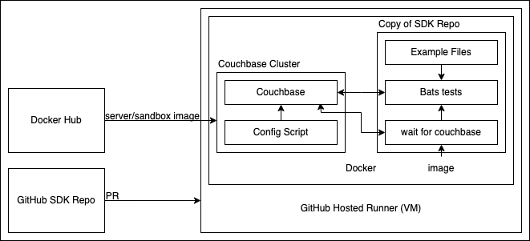

= Couchbase Go SDK Documentation
// Settings:
ifdef::env-github[]
:warning-caption: :warning:
endif::[]
// URLs:
:url-org: https://github.com/couchbase
:url-contribute: https://docs.couchbase.com/home/contribute/index.html
:url-ui: {url-org}/docs-ui
:url-playbook: {url-org}/docs-site

image:https://github.com/couchbase/docs-sdk-go/actions/workflows/test-samples.yml/badge.svg?branch=release%2F2.6[link="https://github.com/couchbase/docs-sdk-go/actions/workflows/test-samples.yml"] 

This repository hosts the documentation source for the Couchbase Go SDK.

== Contributing

Check out the {url-contribute}[contributing guide] to learn how to:

* submit a bug or feedback issue
* set up your documentation workspace
* build the documentation
* submit a pull request

Thank you for helping to make the documentation better.

== Docs Component Configuration

This repository contains an Antora docs component.
Keep in mind these key repository features:

* Component name, version, and start page are configured in each branch's _antora.yml_ file.
* The navigation for all of the modules is stored in the ROOT module's _nav.adoc_ file.
* Production branches use the *release/X.Y* naming pattern (for example, release/5.5, release/6.0).
 ** The {url-playbook}[docs site playbook] instructs Antora to automatically aggregate any branch names that start with *release/*.

== Documentation Site Toolchain

The documentation source files are marked up with AsciiDoc.
Once merged into a version branch, the source files and their assets are aggregated, converted to HTML, and published by Antora to the staging and production sites.
The docs components and {url-ui}[site UI] are orchestrated by the {url-playbook}[docs site playbook].
See the contributing guide to learn more.

== Automated Testing

This repository performs a check on the sample code upon opening a Pull Request. 
These tests need to succeed to perform the merge.

=== Test Framework Structure

The following steps conduct the check:

1. The user opens a PR, triggering the GitHub Action
2. The action creates a GitHub runner VM, and copies the repository over
3. The runner starts the Docker test framework with `docker compose --profile prod up --abort-on-container-exit`. The flag is to verify the database container is also killed when the tests finish.
4. The database and SDK containers start. The following two steps occur concurrently.
** Database Container: Uses the `server/sandbox` image from Docker Hub. This image configures and starts Couchbase, setting up a one node cluster with the travel-sample bucket installed.
** SDK Container: Builds the SDK image from a debian python base image, copying the repository over, and installing dependencies. It then uses `wait-for-couchbase` to ping the Couchbase container, until it confirms the database is fully configured and running.
5. Once the SDK confirms the database is ready for tests, it runs the bats test file. Bats retries each test up to three times upon failure.
6. When the tests have completed, both the SDK and Couchbase containers should die. If they persist, such as in a case where the test framework crashes, the GitHub Action instead destroys them.

=== Testing Code Samples Locally

You may want to run tests locally if you're adding/updating a code sample.
The only prerequisites are a local copy of this repository, and https://www.docker.com/[Docker].
You can start the local test environment by running the following command:

[source, console]
----
docker compose --profile local up
----

This creates two Docker containers with the same structure as described in <<Test Framework Structure>>, with the following changes:

* The bats tests are not automatically performed once Couchbase has finished configuring
* The repository files in the container mount onto the SDK repository in your local machine. 
This means any changes you make to the files on your local machine are instantly reflected in the container.

To run tests, you either need to use the 
https://docs.docker.com/desktop/use-desktop/container/#integrated-terminal[Integrated Terminal] 
feature on Docker Desktop, or SSH into the container from the command line. 
You can use the following command to use the SDK container shell:

[source, console]
----
docker exec -it python-sdk-local /bin/bash
----

Once within the container, run the following command to run a single test:

[source, console]
----
bats -f "<test_name>" test.bats
----

The `-f` flag only runs tests that match the given regular expression.
As test names are in a standard format, you can also run the following to test all the files in a given module:

[source, console]
----
bats -f "<module name>" test.bats
----

=== Creating a New Test

To add a new test, append the following to the `test.bats` file.

[source, bats]
----
@test "[<module>] - <code_file>" {
  runExample $<module_dir_var> <code_file>
  assert_success
}
----

You can find the module directory variables in `test_helper.bash`.
The test name is `"[<module>] - <code_file>"`. 
The name can be anything, but this standard format allows you to carry out single tests, as described in the preceding section.
For more information about creating tests, see the https://bats-core.readthedocs.io/en/stable/writing-tests.html[bats documentation].